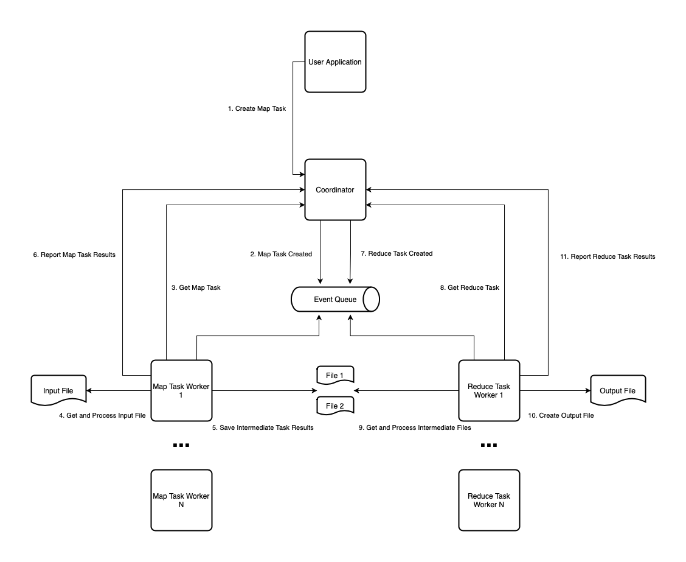

# go-mapreduce

While surfing the internets for project ideas to implement using `Golang`, I stumbled on [an MIT lab for MapReduce implementation](https://pdos.csail.mit.edu/6.824/labs/lab-mr.html).

Making a student-lab project seemed boring to me, so I've decided to turn it to a kind of library/framework that provides primitives and basic implementation for MapReduce-like processing.

## What is MapReduce

MapReduce is a programming model/framework for processing parallelizable problems with large datasets on multiple machines/computers.

You can read more about it on [Wikipedia](https://en.wikipedia.org/wiki/MapReduce) or [in the original paper published by Google](http://static.googleusercontent.com/media/research.google.com/en//archive/mapreduce-osdi04.pdf).

This implementation takes some liberties with the ideas from the original paper, mainly by decoupling the coordinator (called master in the original paper) from workers.

## High-level Design Overview

This repo provides building blocks and complete implementation of the coordinator.

The coordinator is responsible for managing processing tasks, and it allows to:
- Create tasks
- Get tasks for processing
- Report processed task results

The end user application can call the coordinator to create a new map task.

The coordinator saves the map task to persistent storage and notifies any listening workers that a new map task is available for processing.

This communication is done through an event queue and the coordinator does not know anything about the workers.

Workers can listen to this event queue and make a request to the coordinator to get a new task for processing.

After a worker is done with the map task, it reports its result to the coordinator.
If task execution is successful, the coordinator creates a reduce task and notifies workers about it.

The reduce task goes through the same steps of processing.

Here's a diagram with visualization for this workflow:

The workers are implemented by the end user.

The input, intermediate, and output data are files.
The coordinator does not know anything about them besides their identifiers.

The end user decides what to use - a simple Network File System or something more sophisticated like HDFS.

